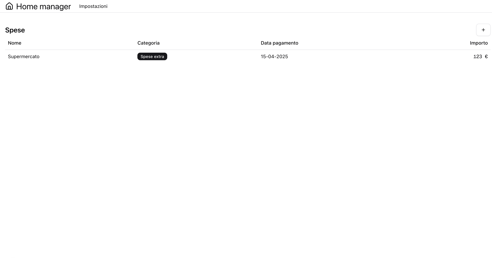
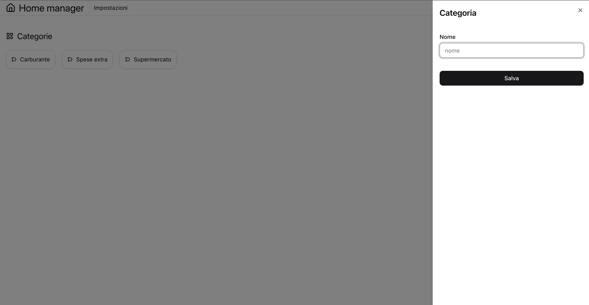

# 🏠 Home Manager

**Track your income and expenses with a clean, modern full-stack app.**  
Home Manager is designed to help individuals and families stay on top of their personal finances with an intuitive interface and powerful features.

---

## 📸 Screenshot




---

## 🚀 Live Demo

> _Coming soon_  
> _(Deploy the project to [Vercel](https://vercel.com) and link it here!)_

---

## 🧱 Tech Stack

- **Frontend**: [Next.js](https://nextjs.org/), [React](https://react.dev/), [TypeScript](https://www.typescriptlang.org/)
- **Styling**: [Tailwind CSS](https://tailwindcss.com/), [Shadcn UI](https://ui.shadcn.com/), [Radix UI](https://www.radix-ui.com/)
- **Backend**: [Drizzle ORM](https://orm.drizzle.team/), PostgreSQL
- **Validation**: [Zod](https://zod.dev/)
- **Forms**: [React Hook Form](https://react-hook-form.com/)
- **Testing**: [Vitest](https://vitest.dev/), [Testing Library](https://testing-library.com/)
- **CI/CD**: GitHub Actions

---

## 📦 Features

- Add income and expense entries
- Categorize transactions
- View balance and history
- Responsive design for mobile and desktop
- Modular architecture for scalability

---

## 🧑‍💻 Getting Started

### 1. Clone the repository

```bash
git clone https://github.com/matteovalerio/home-manager.git
cd home-manager
```

### 2. Install the dependency

```bash
npm i
```

### 3. Start a PostgreSQL instance

You can use Docker, a local installation, or any hosted service.
You can find a simple docker-compose.yaml file that may help you.

> Example with Docker compose:

```bash
docker compose up -d
```

### 4. Sync the database

Push the drizzle schema to your database:

```bash
npm run db:push
Or using another package manager:

yarn db:push

pnpm db:push

bun db:push
```

### 5. Setup env

Create a .env file based on .env.example and fill in your database credentials.

### 6. Launch the dev server

```bash
npm run dev
```

The app will be available at http://localhost:3000.

### 🧪 Running Tests

```bash
npm run test
```

### 📂 Project Structure

/app: Application routes

app/modules: Domain-specific features (e.g. categories, expenses)
../components: UI components and form helpers
../schemas: Zod schemas and validation logic
../queries: queries
../mutation: mutations
../server: server actions

### 💡 Features

[x] Track expenses
[ ] Track incomes
[x] Categorize transactions
[x] Clean and responsive UI

### 📦 Requirements

Node.js 20+

PostgreSQL instance

Package manager (npm, yarn, pnpm, or bun)

### 💡 Architecture Notes

Modular-first approach: every domain (e.g. transactions) is isolated in its own module

Form handling with React Hook Form + Zod for robust client-side and server-side validation

Drizzle ORM ensures type safety and easy migrations

CI runs tests on push and pull requests

### 📣 License

MIT – feel free to use, modify, and share!

### 🙌 Contributions

Pull requests are welcome! Feel free to open issues or suggest improvements.

🧠 Author
Matteo Valerio
@matteovalerio
